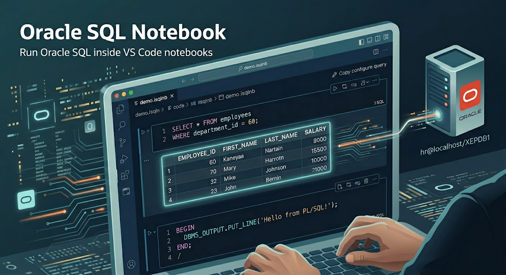
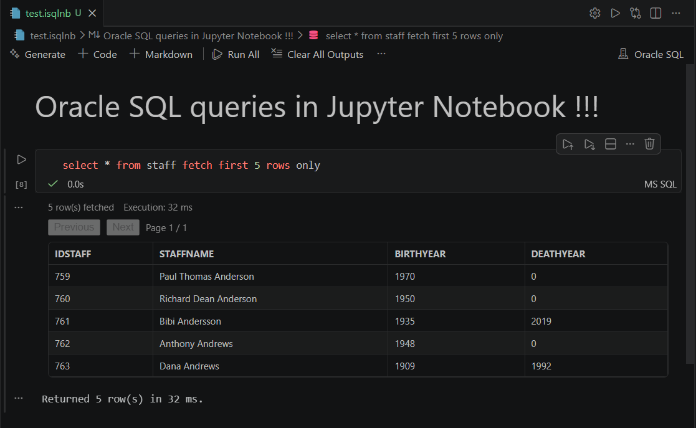
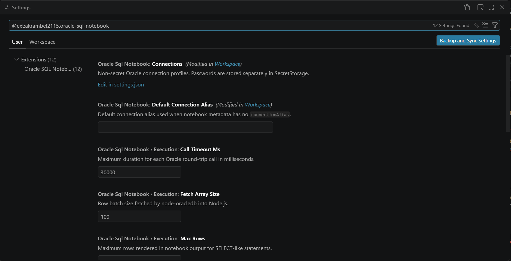
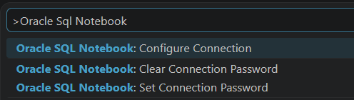

# Oracle SQL Notebook

Run Oracle SQL directly inside VS Code notebooks with a clean, native workflow.



[](https://github.com/akrambel2115/oracle-sql-notebook/releases)
[](https://code.visualstudio.com/)
[](LICENSE)

Oracle SQL Notebook gives you a dedicated `.isqlnb` notebook experience for Oracle development: write queries, execute cells, inspect tabular outputs, and iterate quickly without leaving your editor.

## Why It Feels Better

- Notebook-native SQL workflow for Oracle inside VS Code.
- Rich output renderer for result sets and execution plans.
- Shared session per notebook run for realistic SQL/PLSQL workflows.
- Pool-backed Oracle connections via `node-oracledb`.

## Product Preview




## Quick Start

1. Install the extension from Marketplace or from a local `.vsix` package.
2. Create a notebook file ending with `.isqlnb`, for example `demo.isqlnb`.
3. Configure one or more Oracle profiles in your user or workspace settings.
4. Run `Oracle SQL Notebook: Set Connection Password` once from Command Palette.
5. Execute SQL cells and iterate interactively.

## Configuration

Define non-secret connection profiles and execution preferences in `settings.json`:

```json
{
  "oracleSqlNotebook.defaultConnectionAlias": "dev",
  "oracleSqlNotebook.connections": [
    {
      "alias": "dev",
      "user": "hr",
      "connectString": "localhost/XEPDB1",
      "poolMin": 0,
      "poolMax": 4,
      "poolIncrement": 1
    }
  ],
  "oracleSqlNotebook.execution.maxRows": 1000,
  "oracleSqlNotebook.execution.callTimeoutMs": 30000,
  "oracleSqlNotebook.execution.fetchArraySize": 100,
  "oracleSqlNotebook.execution.prefetchRows": 100,
  "oracleSqlNotebook.security.readOnlyMode": false
}
```



## Query Authoring Notes

- Statements separated by `;` run sequentially in a cell.
- Use `/` on its own line to terminate PL/SQL blocks and script objects.
- Session context is preserved across notebook cells during execution.

```sql
SELECT *
FROM employees
WHERE department_id = 60;
```

```sql
BEGIN
  DBMS_OUTPUT.PUT_LINE('Hello from PL/SQL!');
END;
/
```

## Command Palette Shortcuts

- `Oracle SQL Notebook: Configure Connection`
- `Oracle SQL Notebook: Set Connection Password`
- `Oracle SQL Notebook: Clear Connection Password`



## Security and Trust Model

- Workspace Trust is required for execution and credential operations.
- Optional read-only mode can block non-SELECT and non-CTE execution.
- Blocklist protection can deny specific unsafe SQL prefixes.
- Secrets are not written into notebook files or plain settings values.

## Build, Test, Package

```bash
npm install
npm run check
npm run test
npm run test:e2e
npm run build
npm run package
```

`npm run package` creates a `.vsix` bundle in the project root for local install or distribution.

## Install Local VSIX

1. Open VS Code.
2. Go to Extensions view.
3. Open `...` menu and choose `Install from VSIX...`.
4. Select the generated package file.

## Roadmap Ideas

- Inline explain plans with richer visuals.
- Notebook-level connection switching UI.
- Export outputs to CSV and JSON.
- Performance insights for long-running SQL.

## Contributing

Issues and pull requests are welcome.

- Report bugs: https://github.com/akrambel2115/oracle-sql-notebook/issues
- Project home: https://github.com/akrambel2115/oracle-sql-notebook
